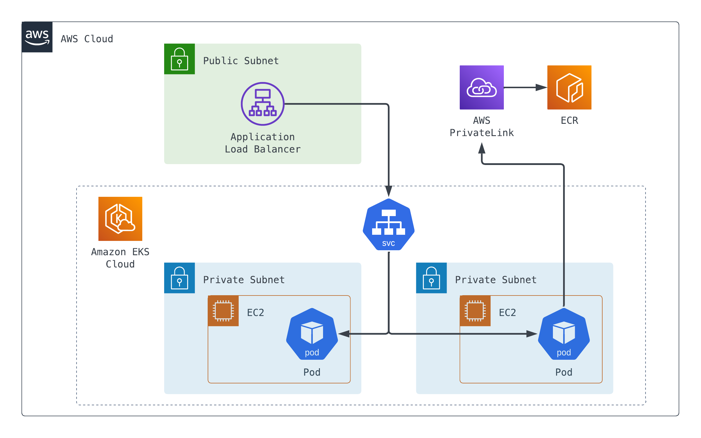

# Closed Network EKS

## Architecture

## Guide
- [aws-load-balancer-controller 설치](guide/)

## Cheat Sheet
- [Install kubectl](https://kubernetes.io/docs/tasks/tools/install-kubectl-linux/)
- [Install Helm](https://helm.sh/docs/intro/install/)
- [EKS create kubeconfig](https://docs.aws.amazon.com/ko_kr/eks/latest/userguide/create-kubeconfig.html)

## Refer
- [aws-load-balancer-controller private ecr 1](https://zigispace.net/1160)
- [aws-load-balancer-controller private ecr 2](https://github.com/kubernetes-sigs/aws-load-balancer-controller/issues/1694#issuecomment-822854710)
- [What does "eksctl create iamserviceaccount"](https://stackoverflow.com/questions/65934606/what-does-eksctl-create-iamserviceaccount-do-under-the-hood-on-an-eks-cluster)
- [Private EKS (without inbound and outbound)](https://repost.aws/ko/knowledge-center/eks-cluster-node-group-private-network)
- [Amazon ECR VPC endpoints (AWS PrivateLink)](https://docs.aws.amazon.com/ko_kr/AmazonECR/latest/userguide/vpc-endpoints.html)

